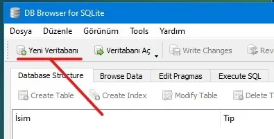

- [Veritabanı](#veritabanı)
  - [sqlite3](#sqlite3)
  - [MySQL](#mysql)
  - [description: Twitter @YusihCano](#description-twitter-yusihcano)
  - [MongoDB](#mongodb)

# Veritabanı

## sqlite3

**sqlite3** kütüphanesi kullanımı kolay ve birkaç aşama ile işlerinizi yapabileceğiniz bir kütüphanedir. **sqlite3** kütüphanesini yüklemek için komut satırına  aşağıdakileri yazın.

> go get github.com/mattn/go-sqlite3

Tablo oluşturma ve düzenleme işlemlerinde bize kolaylık sağlaması için **DB Browser** programına ihtiyacımız olacak. Böylece hızlı bir şekilde veri tabanı olaylarına geçiş yapmış olacağız.  
**DB Browser** programını aşağıdaki adresten indirebilirsiniz.  
[https://sqlitebrowser.org/dl/](https://sqlitebrowser.org/dl/)  
Linux sistemlerin çoğunda **uygulama deposunda** bulunan bir uygulamadır.


Programımızı açıp sol üst taraftan **Yeni Veritabanı**’na tıklayalım.



Veritabanının kayıt yerini, programımızın kodlarının bulunacağı **main.go** dosyası ile aynı yeri seçelim ve ismini **veritabanı.db** olarak kaydedelim. İstediğiniz ismi de verebilirsiniz.


Tablomuzun ismini **kisiler** olarak ayarlayalım. **Alan Ekle**’ye tıklayarak yukarıdaki gibi **id** ve **ad** isminde alanlar oluşturalım. **id** alanının tipini **INTEGER** yaparak, sayısal verileri saklayabilmesini sağlıyoruz. **Birincil Anahtar** ve **Otomatik Arttırma** bölümlerini seçiyoruz. Otomatik Arttırma özelliği sayesinde tabloya veri eklendiğinde **id** içindeki değer her eklemede artacaktır. Bu da her satır için ayırıcı bir özellik olacaktır. **ad** alanının tipini **TEXT** yapıyoruz. **OK** butonuna basarak tabloyu oluşturuyoruz.

  
Böylelikle içerisinde adları depolayabileceğimiz bir veri tabanı olşturmuş olacağız. Oluşturduğumuz tablo her **ad** alanını belirterek veri ekleyişimizde o verinin yanındaki **id** alanına satıra özel numara verecektir.


Tablomuz içindeki kayıtları görmek için **Browse Data** sekmesine tıklayalım. **Table** kısmının yanında tablo oluştururken yazdığımız **kisiler** seçeneğini seçelim. Şuanlık tablomuz boş. Çünkü içine bir kayıtta bulunmadık. **DB Browser** programına bize yardımcı olduğu için teşekkür ederek artık Golang kodlama tarafına geçebiliriz.  


**sqlite3 Kütüphanesinin Kullanımı**  
**main.go** dosyamızı oluşturalım. Kütüphanelerimizi import edelim.

```go
import (
 "database/sql"
 "fmt"
 _ "github.com/mattn/go-sqlite3"
)
```

**database/sql** ile Go üzerinde veri tabanı işlemleri yapabiliyoruz. **fmt**’yi zaten biliyoruz. **github.com/mattn/go-sqlite3** ile de **sqlite3** kullanarak veritabanımızı yönetebiliriz. Buranın başına **\_ \(alt tire\)** eklememizin sebebi **vscode** programı bu kütüphanenin kod içersinde kullanılmadığını düşünerek silmesini önlemek içindir. Basit şekilde veri tabanı bağlantısı nasıl yapılır görelim.

```go
package main
import (
 "database/sql"
 "fmt"
 _ "github.com/mattn/go-sqlite3"
)
func main() {
 vt, _ := sql.Open("sqlite3", "./veritabanı.db") //veri tabanı dosyamız
 //Veri tabanı işlemleri için kodları yazacağımız bölüm
 vt.Close() //İşimiz bittikten sonra veri tabanımızı kapatıyoruz
}
```

**sqlite3 Veri Ekleme İşlemi**

```go
func main() {
 vt, _ := sql.Open("sqlite3", "./veritabanı.db")
 işlem, _ := vt.Prepare("INSERT INTO kisiler(ad) values(?)")
 //Hangi bölüme eklenecekse yukarıda orayı belirtiyoruz
 veri, _ := işlem.Exec("Mustafa Kemal ATATÜRK") //Eklenecek değer
 id, _ := veri.LastInsertId() //Son girişin id numarısını aldık
 fmt.Println("Son kişinin id'si", id)
 vt.Close() //İşimiz bittikten sonra veri tabanımızı kapatıyoruz
}
```

**sqlite3 Veri Güncelleme İşlemi**

```go
func main() {
 vt, _ := sql.Open("sqlite3", "./veritabanı.db")
 id:=1
 //değiştirilecek kısmın id numarası
 işlem, _ := vt.Prepare("update kisiler set ad=? where id=?")
 //Güncellenecek kısmı belirtiyoruz
 veri, _ := işlem.Exec("Gazi M. K. ATATÜRK", id)
 //Değişiklik ve Değiştirilen verinin id'si
 değişiklik, _ := veri.RowsAffected()
 fmt.Println("Değişen kişinin id'si: ", değişiklik)
 vt.Close() //İşimiz bittikten sonra veri tabanımızı kapatıyoruz
}
```

**sqlite3 Veri Silme İşlemi**

```go
func main() {
 vt, _ := sql.Open("sqlite3", "./veritabanı.db")
 işlem, _ := vt.Prepare("delete from kisiler where id=?")
 //id numarasına göre sileceğiz
 veri, _ := işlem.Exec(id) //Silinecek kişinin id'si
 değişiklik, _ := veri.RowsAffected() //Silinen kişinin id'sini aldık
 fmt.Println("Silinen kişinin id'si: ", değişiklik)
 vt.Close()
}
```

**sqlite3 Veri Sorgulama İşlemi**

```go
func main() {
 vt, _ := sql.Open("sqlite3", "./veritabanı.db")
 tablo, _ := vt.Query("SELECT * FROM kisiler")
 //Bu kısma sorguyu kullanıcağımız kodları yazacağız.
 tablo.Close() //İşimiz bittiği için tablo sorgulamayı kapattık
 vt.Close() //İşimiz bittikten sonra veri tabanımızı kapatıyoruz
}
```

Yukarıda **kisiler** tablosundaki tüm verileri sorgulamış olduk. Bir sonraki bölümde tablomuzdaki verileri nasıl kullanıcıya gösterebileceğimizi öğreneceğiz.  
**sqlite3 Verileri Sıralama/Gösterme İşlemi**

```go
func main() {
 vt, _ := sql.Open("sqlite3", "./veritabanı.db")
 tablo, _ := vt.Query("SELECT * FROM kisiler")
 var id int
 var ad string
 for tablo.Next() {
  aktarma := tablo.Scan(&id, &ad)
  //Tablo bölümlerini değişkenlere aktardık
  if aktarma == nil { //Boş mu kontol ediyoruz
   fmt.Println("Kişiler listesi boş")
  }else{
   //Boş değilse verileri ekrana bastırıyoruz
   fmt.Println(id, ad)
  }
 }
 tablo.Close() //İşimiz bittiği için tablo sorgulamayı kapattık
 vt.Close() //İşimiz bittikten sonra veri tabanımızı kapatıyoruz
}
```

## MySQL

**MYSQL**, bir ilişkisel veritabanı yönetim sistemidir. MySQL yönetimi için kullanacağımız kütüphanenin adı **Go-MySQL-Driver**. Kütüphanemizi aşağıdaki gibi komut satırına yazarak indirelim.

> go get -u github.com/go-sql-driver/mysql

MySQL paketlerimizi import edelim.

```go
import "database/sql"
import _ "go-sql-driver/mysql"
```

**MySQL Bağlantısını Yapma**  
Daha sonra **main\(\)** fonksiyonumuz içerisinde MySQL bağlantımızı yapalım.

```go
package main
import "database/sql"
import _ "go-sql-driver/mysql"
func main(){
	db, err := sql.Open("mysql", "kullanici:sifre@(127.0.0.1:3306)/vtismi?parseTime=true")
	err := db.Ping()
}
```

**db** adındaki fonksiyonel değişkenimize MySQL veritabanı bağlantı bilgilerimizi girdik. **kullanici** yeri MySQL kullanıcı adınızı, **sifre** yerine MySQL şifrenizi, **127.0.0.1:3306** yerine MySQL sunucunuzu e **vtismi** yerine de Veritabanı isminizi yazmayı unutmayın.  
Daha sonra veritabanı bağlantı bilgilerimizi doğrulanmak için **db.Ping\(\)** fonksiyonu ile bağlantı denemesi yolluyoruz. Bir hata ile karşılaşıldığında **err** değişkeninin içine hata çıktısını kaydedecektir.  
Kolaylık olsun diye **main\(\)** fonksiyonu dışına hata çıktılarını kontrol eden bir fonksiyon yazalım.

```go
func kontrol(hata error){
    if hata != nil{
        log.Fatal(hata)
    }
}
```

Eğer hata çıktısı almak istemiyorsanız. **err** değişkeni yerine **\_ \(alt tire\)** koyabilirsiniz. Aynen şu şekilde:

```go
db, _ := sql.Open("mysql", "kullanici:sifre@(127.0.0.1:3306)/vtismi?parseTime=true")
```

**İlk Tabloyu Oluşturma**  
Tablomuz şu şekilde olacak;  


| id | kullanici | sifre | tarih |
| :--- | :--- | :--- | :--- |
| 1 | kaan | 1234 | 2019-08-10 12:30:00 |

Böyle bir tablo yapısını oluşturmak için aşağıdaki sorguyu çalıştırmamız gerekir.

```sql
CREATE TABLE kullanicilar (
    id INT AUTO_INCREMENT,
    kullanici TEXT NOT NULL,
    sifre TEXT NOT NULL,
    tarih DATETIME,
    PRIMARY KEY (id)
);
```

Bu sorguyu Golang tarafında yapmak istersek aşağıdaki gibi yazabiliriz.

```go
sorgu := `
    CREATE TABLE kullanicilar (
        id INT AUTO_INCREMENT,
        kullanici TEXT NOT NULL,
        şifre TEXT NOT NULL,
        tarih DATETIME,
        PRIMARY KEY (id)
    );`
//Sorguyu çalıştırma
_, err := db.Exec(sorgu)
```

Bu işlemle birlikte MySQL veritabanımızda **kullanicilar** adında bir tablomuz oluşacaktır.  
**Tabloya Veri Girme**

```go
kullaniciDegeri := "johndoe"
sifreDegeri := "secret"
tarihDegeri := time.Now()
sonuc, err := db.Exec(`INSERT INTO kullanicilar (kullanici, sifre, tarih) VALUES (?, ?, ?)`, kullaniciDegeri, sifreDegeri, tarihDegeri)
kullaniciID, err := sonuc.LastInsertId()
fmt.Println("Eklenen kullanıcının id'si:", kullaniciID)
```

**Tabloya Sorgu Yapma**

```go
//Tabloyu sorgulayıp sonuçları değişkenlere yazdıralım
sorgu:= `SELECT id, kullanici, sifre, tarih FROM kullanicilar WHERE id = ?`
err := db.QueryRow(sorgu, sorguid).Scan(&id, &kullanici, &sifre, &tarih)
//Çıkan aldığımız verileri ekrana bastıralım
fmt.Println(id, kulanici, sifre, tarih)
```

**Tablodaki Tüm Verileri Sıralama**

```go
var (
    id int
    kullanici string
    sifre string
    tarih time.Time
)
tablo, _ := db.Query(`SELECT id, kullanici, sifre, tarih FROM kullanicilar`)
defer tablo.Close() //tabloyu kapamayı unutmuyoruz
for tablo.Next() {
    err := tablo.Scan(&id, &kullanici, &sifre, &tarih)
    kontrol(err)
    fmt.Println(id, kullanici, sifre, tarih) //kullaniciyi ekrana bastır
}
err := tablo.Err()
kontrol(err)
```

Eğer tablodaki verileri ekrana bastırmak yerine bir **diziye** \(array\) kaydetmek istiyorsak aşağıdaki gibi yapabiliriz.

```go
type kullanici struct {
    id        int
    kullanici  string
    sifre  string
    tarih time.Time
}
tablo, _ := db.Query(`SELECT id, kullanici, sifre, tarih FROM kullanicilar`)
defer rows.Close()
var kullanicilar []kullanici
for tablo.Next() {
    var k kullanici
    err := tablo.Scan(&k.id, &k.kullanici, &k.sifre, &k.tarih)
    kontrol(err)
    kullanicilar = append(kullanicilar, k)
}
err := tablo.Err()
kontrol(err)
```

Bu işlemin sonucunda kullanicilar dizimiz şu şekilde olacaktır.

```jsx
kullanicilar {
    kullanici {
        id:        1,
        kullanici:  "ahmet",
        sifre:  "1234",
        tarih: time.Time{wall: 0x0, ext: 63701044325, loc: (*time.Location)(nil)},
    },
    kullanici {
        id:        2,
        kullanici:  "mehmet",
        sifre:  "5678",
        tarih: time.Time{wall: 0x0, ext: 63701044622, loc: (*time.Location)(nil)},
    },
}
```

**Tablodan Satır Silme**

```go
silineceksatir := 1
_, err := vt.Exec(`DELETE FROM kullanicilar WHERE id = ?`, silineceksatir)
kontrol(err)
```

Gördüğünüz gibi basit bir şekilde MySQL paketi ile veritabanı yönetimi yapabiliyoruz.  
**Hepsi Bir Arada**

```go
package main
import (
	"database/sql"
	"fmt"
	"log"
	"time"
	_ "github.com/go-sql-driver/mysql"
)
func kontrol(err error) {
	if err != nil {
		log.Fatal(err)
	}
}
func main() {
	vt, err := sql.Open("mysql", "kullanici:sifre@(127.0.0.1:3306)/vtismi?parseTime=true")
	if err := db.Ping(); err != nil {
		kontrol(err)
	}
	{ // Yeni tablo oluştur
		sorgu := `
            CREATE TABLE kullanicilar (
                id INT AUTO_INCREMENT,
                kullanici TEXT NOT NULL,
                sifre TEXT NOT NULL,
                tarih DATETIME,
                PRIMARY KEY (id)
            );`
		_, err := db.Exec(sorgu)
		kontrol(err)
	}
	{ // Yeni kayıt ekle
		kullanici := "kaan"
		sifre := "1234"
		tarih := time.Now()
		sonuc, err := db.Exec(`INSERT INTO kullanicilar (kullanici, sifre, tarih) VALUES (?, ?, ?)`, username, password, createdAt)
		kontrol(err)
		eklenenid, err := sonuc.LastInsertId()
		fmt.Println(eklenenid)
	}
	{ //  İstenilen kaydı sorgulama
		var (
			id        int
			kullanici string
			sifre     string
			tarih     time.Time
			sorguid   int = 1
		)
		sorgu := "SELECT id, kullanici, sifre, tarih FROM kullanici WHERE id = ?"
		err := vt.QueryRow(sorgu, sorguid).Scan(&id, &kullanici, &sifre, &tarih)
		kontrol(err)
		fmt.Println(id, kullanici, sifre, tarih)
	}
	{ // Tün kayıtları sorgula
		type kullanici struct {
			id        int
			kullanici string
			sifre     string
			tarih     time.Time
		}
		tablo, err := vt.Query(`SELECT id, kullanici, sifre, tarih FROM kullanicilar`)
		kontrol(err)
		defer tablo.Close()
		var kullanicilar []kullanici
		for tablo.Next() {
			var k kullanici
			err := tablo.Scan(&k.id, &k.kullanici, &k.sifre, &k.tarih)
			kontrol(err)
			kullanici = append(kullanicilar, k)
		}
		err := rows.Err()
		kontrol(err)
		fmt.Printf("%#v", kullanicilar)
	}
	//Kayıt Sil
	{
		silinecekid := 1
		_, err := vt.Exec(`DELETE FROM kullanicilar WHERE id = ?`, silinecekid)
		kontrol(err)
	}
}
```

---
description: Twitter @YusihCano
---

## MongoDB

**MongoDB** 2009 yılında geliştirilmiş açık kaynak kodlu bir NoSQL veritabanıdır. Şimdi Go ile MongoDB veritabanını kullanmak için `mongo-driver` paketini indirelim.

> go get go.mongodb.org/mongo-driver/mongo

Kodu sürekli tekrardan yapıştırmamak için import edilecek tüm kütüphaneler burada :

```go
package main

import (
    "context"
    "log"
    "time"

    "go.mongodb.org/mongo-driver/bson"
    "go.mongodb.org/mongo-driver/bson/primitive"
    "go.mongodb.org/mongo-driver/mongo"
    "go.mongodb.org/mongo-driver/mongo/options"
)
```

Şimdi de `database` ile bağlantıyı sağlayalım. Eğer database adresini bilmiyorsanız mongo konsolunuzun nereye bağlandığına bakarak database adresini bulabilirsiniz.

```go
databaseURL := "mongodb://127.0.0.1:27017"
ctx, _ := context.WithTimeout(context.Background(), 10*time.Second)
client, err := mongo.Connect(ctx, options.Client().ApplyURI(databaseURL))
if err != nil {
    log.Fatal("Hata : " + err.Error())
}
kisiler := client.Database("test").Collection("kisiler")
```

Bu kısım `main` fonksiyonununun başlangıcı. Kısaca yapılan ise ilk satırda database adresini verdik. Ardından 10 saniye timeout'u olan bir context açtık. Context ve database adresini kullanarak bağlantımızı gerçekleştirdik.Son satırda da istedigimiz veritabanı ve collection'u çektik. Bundan sonra isim adında bir struct oluşturalım. Kişinin ismini ve yaşını tutsun.

```go
type Kisi struct {
    ID   primitive.ObjectID `bson:"_id,omitempty" json:"id,omitempty"`
    Isim string             `bson:"isim,omitempty" json:"isim,omitempty"`
    Yas  int                `bson:"yas,omitempty"json:"yas,omitempty"`
}
```

Şimdi de bir kişi oluşturup database'e ekleyelim.

```go
birisi := Kisi{
    Isim: "Ahmet",
    Yas:  42,
}
res, err := kisiler.InsertOne(context.TODO(), birisi)
if err != nil {
    log.Fatal("Hata : " + err.Error())
}

id := res.InsertedID
fmt.Println(id)
```

Kişi oluşturma ve ekleme işlemlerinden sonra eklenen verinin id'sini de yazdırdık. MongoDB Compass ya da konsol üzerinden `db.kisiler.find()` yaparak eklenen veriyi görebiliriz. Şimdi de veri okuma yapalım. Tüm verileri almak için :

```go
ctx, _ = context.WithTimeout(context.Background(), 30*time.Second)
cur, err := kisiler.Find(ctx, bson.D{})
if err != nil {
    log.Fatal("Hata : " + err.Error())
}
defer cur.Close(ctx)
var list []Kisi
for cur.Next(ctx) {
    var result Kisi
    err := cur.Decode(&result)
    if err != nil {
        log.Fatal("Hata : " + err.Error())
    }
    list = append(list, result)
}
if err := cur.Err(); err != nil {
    log.Fatal("Hata : " + err.Error())
}
fmt.Println(list)
```

Şimdi de her hangi bir özelliğe göre arama yapalım.

```go
var result Kisi
ctx, _ = context.WithTimeout(context.Background(), 5*time.Second)
err = kisiler.FindOne(ctx, bson.M{"yas": 42}).Decode(&result)
if err != nil {
    log.Fatal("Hata : " + err.Error())
}
out, err := json.Marshal(&result)
if err != nil {
    log.Fatal("Hata : " + err.Error())
}
fmt.Println(string(out))
```

Silme işlemi yapalım.

```go
ctx, _ = context.WithTimeout(context.Background(), 5*time.Second) // Context for Delete
_, err = kisiler.DeleteOne(ctx, bson.D{{"yas", 39}})              // Delete User
if err != nil {
    log.Fatal("Hata : " + err.Error())
}
```

İsterseniz başka bir değer üzerinden de silme işlemi yapabilirsiniz. Ben direk istenen veriyi silmek için id kullanmanızı tavsiye ediyorum. Şimdi de Update ile temel fonksiyonları bitirelim.

```go
degisecek := Kisi{
    Isim: "Kemal",
    Yas:  39,
}
yeni := Kisi{
    Isim: "Kemal",
    Yas:  100,
}
var filtre bson.M
bytes, err := bson.Marshal(degisecek)
if err != nil {
    log.Fatal("Hata : " + err.Error())
}
bson.Unmarshal(bytes, &filtre)
var usr bson.M
bytes, err = bson.Marshal(yeni)
if err != nil {
    log.Fatal("Hata : " + err.Error())
}
bson.Unmarshal(bytes, &usr)
update := bson.D{
    {"$set", usr},
}
ctx, _ = context.WithTimeout(context.Background(), 5*time.Second)
_, err = kisiler.UpdateOne(ctx, filtre, update)
if err != nil {
    log.Fatal("Hata : " + err.Error())
}
```

