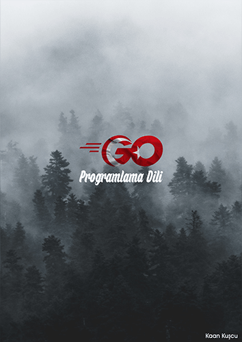

# Go Programlama Dili - Kaan Kuşçu

 - [Kitap Hakkında](./01-kitap-hakkinda.md)
 - [Bölüm 1 - Ön Eğitim](./02-bolum-1-on-egitim.md)
 - [Bölüm 2 - İşlem Yapma](./03-bolum-2-islem-yapma.md)
 - [Bölüm 3 - Gruplama](./04-bolum-3-gruplama.md)
 - [Bölüm 4 - Eşzamanlılık](./05-bolum-4-es-zamanlilik.md)
 - [Bölüm 5](./06-bolum-5.md)
 - [Bölüm 6 - Paketler](./07-bolum-6-paketler.md)
 - [Bölüm 7 - Dosya İşlemleri](./08-bolum-7-dosya-islemleri.md)
 - [Veritabanı](./09-veritabani.md)
 - [Web Sunucu (Server)](./10-web-sunucu.md)
 - [GUI (Grafiksel Kullanıcı Arayüzü)](./11-gui.md)
 - [Mikro-denetleyiciler](./12-mikro-denetleyiciler.md)
 - [Pratik Bilgiler](./13-pratik-bilgiler.md)
