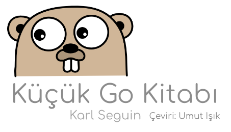

# Küçük Go Kitabı - Karl Seguin

 - [Kitap Hakkında](./01-Kitap-Hakkinda.md)
 - [Giriş](./02-Giris.md)
 - [Başlarken](./03-Baslarken.md)
 - [Bölüm 1 - Temel Bilgiler](./04-Bolum-1-Temel-Bilgiler.md)
 - [Bölüm 2 - Veri Yapıları](./05-Bolum-2-Veri-Yapilari.md)
 - [Bölüm 3 - Map, Array ve Slice](./06-Bolum-3-Map,-Array-ve-Slice.md)
 - [Bölüm 4 - Kod Organizasyonu ve Arayüzler](./07-Bolum-4-Kod-Organizasyonu-ve-Arayuzler.md)
 - [Bölüm 5 - Yararlı Bilgiler](./08-Bolum-5-Yararli-Bilgiler.md)
 - [Bölüm 6 - Eşzamanlılık](./09-Bolum-6-Eszamanlilik.md)
 - [Sonuç](./10-Sonuc.md)
